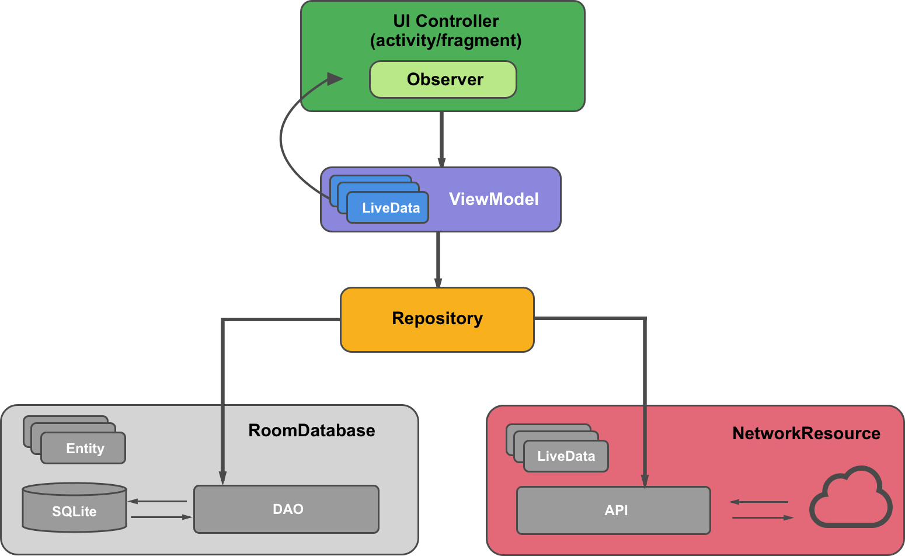

<h1 align="center">ARCHITECTURE COMPONENTS PROJECT TAKY EDITION V.1</h1>
<h2 align="center">POWERED BY ORBIS MOBILE TEAM </h2>

<p align="center">
    
</p>


## Summary

This Android Sample Project uses MVVM architectural pattern helped by three powerful technologies
which are Kotlin, Dagger 2 and Architecture Components.

Additionally this project uses the Repository Pattern.

<p align="center">
    
</p>

## PREREQUISITIES
1. Download the web service project from https://github.com/CarlitosDroid/docker-mysql-nodejs
2. Run the project with `docker-compose up` command from terminal
3. Run `ifconfig | grep 192. command from terminal and copy the ip address
4. Go to build.gradle file at top level and paste it there:

```gradle
ext {
    ipAdress = '192.168.8.102'
    port = 8123
    ...
}
```

## How Does the project works?

At first, searches a user from local DB and shows on the screen but If if we don't have any user then
we'll fetch data from Remote(our Web Service).

## How to add new package like test_common inside src folder?
1. Change to Project View Type.
2. Right click on src folder.
3. Go to New > Directory > test_common.
4. Right click on test_common folder > New > Folder > Java Folder > change folder destination > **src/test_common/java**

# How to create a resources folder in test
1. Right click on src folder.
2. New > Folder > Assets Folder > change folder destination > **src/test/resources/**
